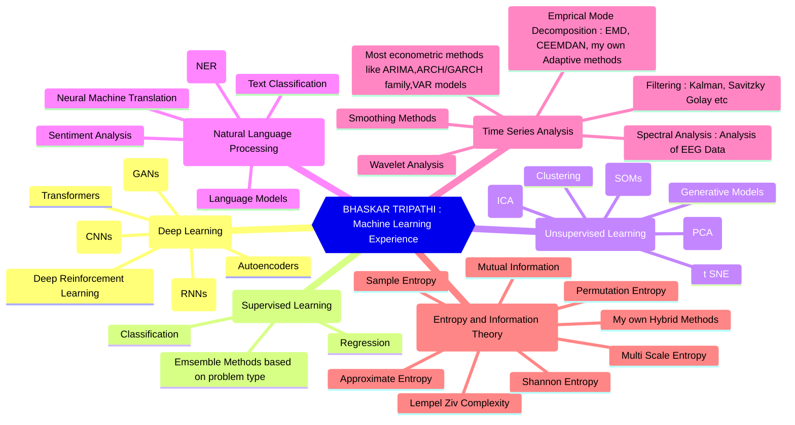
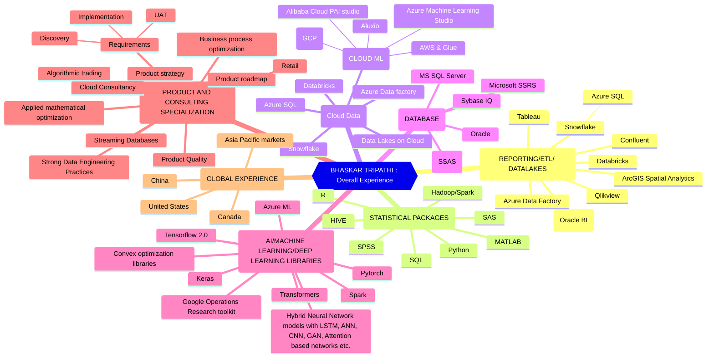
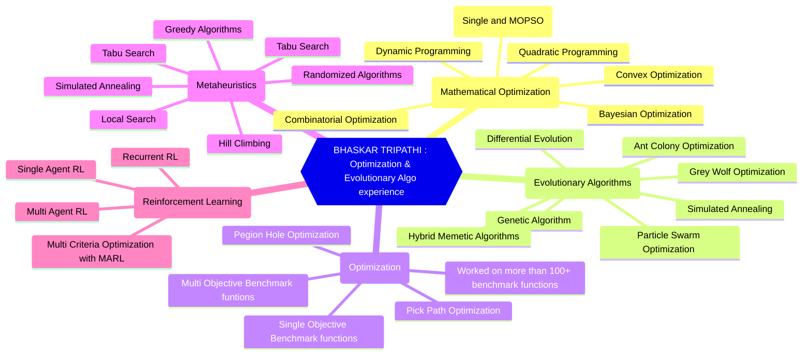

### Hi there 👋
Visit me at www.bhaskartripathi.com for more details. 
### ⚙️ &nbsp;My GitHub Statistics

  Visit my GitHub for a portfolio of my work and stats:
  

  For collaborations and discussions, book a meeting with me:
  <a href="https://calendly.com/bhaskar-tripathi/30min">Schedule Here</a>

### 🤝🏻 &nbsp;Contact Me

# My Machine Learning experience

# My overall experience Summary

# My Experience in Mathematical Optimization

<!--
**bhaskatripathi/bhaskatripathi** is a ✨ _special_ ✨ repository because its `README.md` (this file) appears on your GitHub profile.

Here are some ideas to get you started:

- 🔭 I’m currently working on ...
- 🌱 I’m currently learning ...
- 👯 I’m looking to collaborate on ...
- 🤔 I’m looking for help with ...
- 💬 Ask me about ...
- 📫 How to reach me: ...
- 😄 Pronouns: ...
- ⚡ Fun fact: ...
-->
